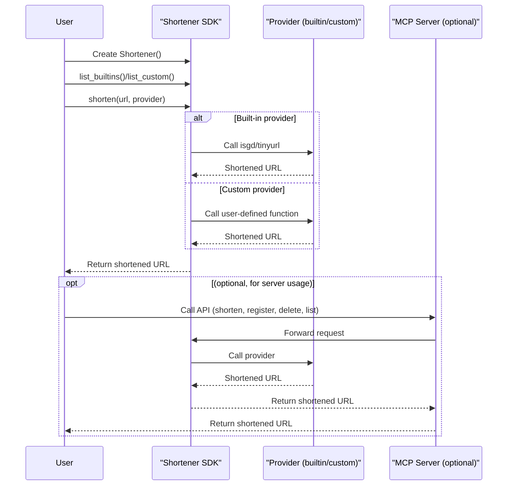

# shortl 🚀

A modern, extensible Python library for URL shortening with built-in and custom providers. Use as a simple SDK or as a server for LLM and automation workflows.


[](https://opensource.org/licenses/MIT)

> **Why shortl?**
> 
> - One-liner URL shortening for any Python project
> - Register your own providers at runtime
> - Built-in server for LLMs and automation

---

## 📚 Table of Contents
- [Overview](#overview)
- [Features](#features)
- [Quickstart](#quickstart)
- [How It Works](#how-it-works)
- [Providers](#providers)
- [API Reference](#api-reference)
- [Advanced Usage](#advanced-usage)
- [Contributing](#contributing)
- [License](#license)

---

## 📝 Overview

**shortl** is a Python library and server for URL shortening. It supports both popular built-in providers (like is.gd and TinyURL) and user-defined custom providers, which can be registered at runtime as Python functions or code strings. Use it as a lightweight SDK or as a server (via MCP) to power LLMs and automation tools.

---

## ✨ Features

- 🔗 **Simple API**: Shorten URLs with a single method call
- 🏗️ **Built-in Providers**: Use is.gd and TinyURL out of the box
- 🧩 **Extensible**: Register your own Python functions or code as shorteners at runtime
- 🗂️ **Provider Management**: List, add, and remove custom providers dynamically
- 🛡️ **Type-annotated**: All code uses Python built-in type annotations for clarity and safety
- 🤖 **MCP Server Integration**: Expose all features to LLMs and automation via the Model Context Protocol

---

## ⚡ Quickstart

### Requirements
- Python >= 3.12

### Installation (Recommended: [uv](https://github.com/astral-sh/uv))

```sh
uv add git+https://github.com/mdonmez/shortl.git@master#egg=shortl
```

### Alternative: pip

```sh
pip install git+https://github.com/mdonmez/shortl.git@master#egg=shortl
```

### Minimal Example (SDK)

```python
from shortl.shortl import Shortener, custom_shortener

shortener = Shortener()

# Built-in provider
print(shortener.shorten("https://example.com", "isgd"))

# Custom provider
@custom_shortener
def myshort(url: str) -> str:
    return "short-" + url

print(shortener.shorten("https://example.com", "myshort"))
```

### Minimal Example (MCP Server)

Add this config to your MCP client to use the shortl MCP server:

```json
"shortl": {
    "command": "uvx",
    "args": [
        "--from",
        "git+https://github.com/mdonmez/shortl.git@master[mcp]",
        "shortl_mcp"
    ]
}
```

This exposes tools for:
- Creating custom providers
- Deleting custom providers
- Listing providers
- Shortening URLs

---

## 🛠️ How It Works

shortl provides a unified, extensible interface for shortening URLs. Use built-in or custom providers, and optionally run as a server for LLM/automation workflows.

### Sequence Diagram



---

## 🔌 Providers

### Built-in Providers

| Name     | Description                        | Link                        |
|----------|------------------------------------|-----------------------------|
| `isgd`   | Shorten URLs using is.gd           | [is.gd](https://is.gd)      |
| `tinyurl`| Shorten URLs using TinyURL         | [TinyURL](https://tinyurl.com) |

### Custom Providers

You can register your own providers at runtime as Python functions or code strings.

#### Register a Custom Provider (Function)

```python
def myshort(url: str) -> str:
    return "short-" + url

from shortl.shortl import Shortener
Shortener.register_custom(myshort)
```

#### Register a Custom Provider (Code String)

```python
code = """
def foo(url: str) -> str:
    return 'f-' + url
"""
Shortener.register_custom(code)
```

#### Delete a Custom Provider

```python
Shortener.delete_custom("myshort")
```

#### List Providers

```python
shortener = Shortener()
print(shortener.list_builtins())  # ["isgd", "tinyurl"]
print(shortener.list_custom())    # ["myshort", ...]
```

> **Note:** Built-in providers cannot be deleted.

---

## 📖 API Reference

### Shortener Class

| Method | Signature | Description |
|--------|-----------|-------------|
| `shorten` | `shorten(url: str, provider: str | object) -> str` | Shorten a URL using a provider (by name or callable) |
| `list_builtins` | `list_builtins() -> list[str]` | List all built-in providers |
| `list_custom` | `list_custom() -> list[str]` | List all custom providers |
| `register_custom` | `register_custom(func_or_code: str | object) -> str` | Register a custom provider (function or code string) |
| `delete_custom` | `delete_custom(provider_name: str) -> bool` | Delete a custom provider by name |

### MCP Server Tools

| Tool | Description |
|------|-------------|
| `create_custom_shortener(code: str) -> str` | Register a new custom provider from code |
| `delete_custom_provider(provider_name: str) -> bool` | Delete a custom provider |
| `list_providers() -> list[dict[str, str]]` | List all providers with type info |
| `shorten(url: str, provider: str) -> str` | Shorten a URL using a provider |

---

## 🧑‍💻 Advanced Usage

### Error Handling

- Raises `ValueError` if a provider is not found
- Raises `TypeError` if a provider is not callable or returns the wrong type
- Handles network and provider errors gracefully

#### Example: Handling Errors

```python
try:
    shortener.shorten("https://example.com", "notfound")
except ValueError as e:
    print("Provider not found:", e)
```

### Using as a Server (MCP Integration)

- Exposes all features via the Model Context Protocol (MCP)
- Designed for LLMs and automation tools
- Always up-to-date with the latest version

#### Example MCP Client Config

```json
"shortl": {
    "command": "uvx",
    "args": [
        "--from",
        "git+https://github.com/mdonmez/shortl.git@master[mcp]",
        "shortl_mcp"
    ]
}
```

---

## 🤝 Contributing

Contributions are welcome! Please open issues or pull requests for bug fixes, new features, or documentation improvements.

- Code style: Use built-in Python type annotations
- Tests: Run with `uv run pytest`

---

## 📄 License

This project is licensed under the MIT License. See [LICENSE](LICENSE) for details.

---

<sub>Made with ❤️ by Muhammed Dönmez</sub> 