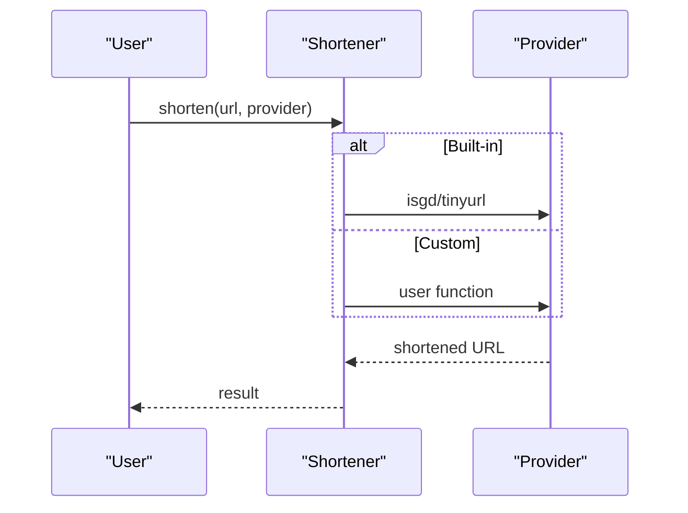
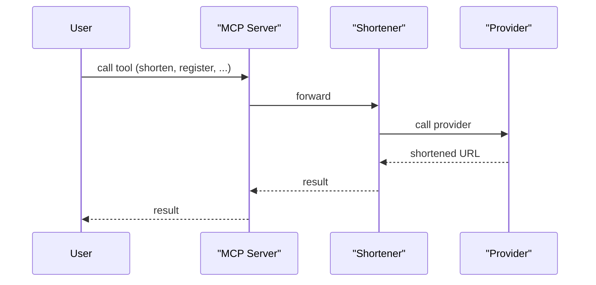

# shortl

A minimal, extensible Python library for URL shortening with built-in and custom providers. Use as a local SDK or expose as an MCP server for LLMs and automation.

---


[](https://opensource.org/licenses/MIT)

---

## 🚀 Features
- Simple, type-annotated API
- Built-in providers: `isgd`, `tinyurl`
- Register custom Python shorteners at runtime (decorator or code)
- List, add, and remove custom providers
- MCP server: expose all features as tools for LLMs/automation

---

## 📦 Installation

**Requires Python >= 3.12**

```sh
uv add git+https://github.com/mdonmez/shortl.git@master#egg=shortl
```

---

## 🛠️ Usage

### SDK: Built-in & Custom Providers

```python
from shortl.shortl import Shortener, custom_shortener

shortener = Shortener()

# Built-in provider
print(shortener.shorten("https://example.com", "isgd"))

# Custom provider (decorator)
@custom_shortener
def myshort(url: str) -> str:
    return "short-" + url

print(shortener.shorten("https://example.com", "myshort"))
```

#### Mermaid: SDK Flow



---

### 🤖 MCP Server Integration

Expose all features as remote tools for LLMs or automation via [MCP](https://github.com/mdonmez/mcp):

**Run server:**
```sh
uv run -m shortl.mcp_server
```

**MCP client config example:**
```json
"shortl": {
  "command": "uvx",
  "args": [
    "--from",
    "git+https://github.com/mdonmez/shortl.git@master[mcp]",
    "shortl_mcp"
  ]
}
```

**Tools provided:**
- `shorten(url, provider)`
- `create_custom_shortener(code)`
- `delete_custom_provider(name)`
- `list_providers()`

#### Mermaid: MCP Flow



---

## 🔗 Providers

- **Built-in:**
  - `isgd`: [is.gd](https://is.gd)
  - `tinyurl`: [TinyURL](https://tinyurl.com)
- **Custom:**
  - Register via decorator or code string (see usage)
  - List: `shortener.list_custom()`
  - Remove: `Shortener.delete_custom(name)`

---

## ⚙️ API & Error Handling

- All methods are type-annotated (built-in types)
- Raises `ValueError` if provider not found
- Raises `TypeError` if provider is not callable or returns wrong type
- Handles network/provider errors gracefully

---

## 🤝 Contributing

PRs and issues welcome!

---

## 📝 License

MIT. See [LICENSE](LICENSE). 