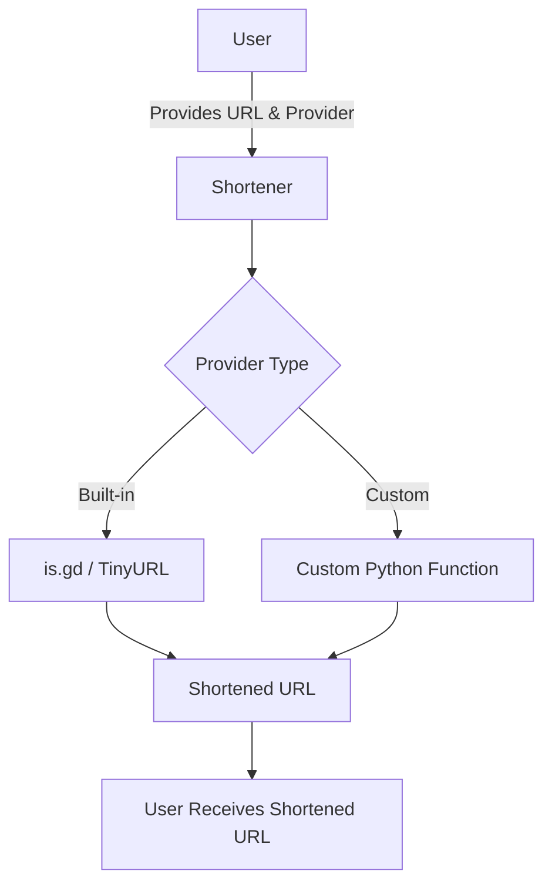

# shortl

shortl is a minimal, extensible Python library for URL shortening, supporting both built-in and custom providers. Use it as a local SDK or expose it as an MCP server for LLMs and automation workflows.


[](https://opensource.org/licenses/MIT)

---

## Table of Contents

- [Overview](#overview)
- [Features](#features)
- [Installation](#installation)
- [Providers](#providers)
- [Usage](#usage)
- [MCP Server](#mcp-server)
- [Contributing](#contributing)
- [License](#license)

## Overview

shortl acts as a simple SDK for URL shortening. You provide a URL and a provider; shortl forwards the request to the provider and returns the shortened URL. It is designed to be lightweight, fast, and easy to extend.

### How It Works



## Features

- **Fast & Lightweight**: Minimal dependencies, small footprint, no configuration required.
- **Extensible**: Register your own custom providers as Python functions.
- **Type-Annotated**: All methods use built-in Python type annotations for safety and clarity.
- **MCP Server**: Optionally expose all features via a Model Context Protocol (MCP) server for LLM and automation integration.

## Installation

### Prerequisites
- Python >= 3.12

### Install SDK

```bash
uv add git+https://github.com/mdonmez/shortl.git@master#egg=shortl
```

This command installs the latest stable version of shortl directly from GitHub.

## Providers

shortl supports both built-in and custom providers for URL shortening.

### Built-in Providers
- **isgd**: Uses [is.gd](https://is.gd) for URL shortening.
- **tinyurl**: Uses [TinyURL](https://tinyurl.com) for URL shortening.

### Custom Providers
You can register your own providers as Python functions:

```python
def myshort(url: str) -> str:
    # Your shortening logic here
    return "https://example.com/" + url
```

## Usage

### Using Built-in Providers

```python
from shortl.shortl import Shortener

s = Shortener()

print(s.shorten("https://example.com", "isgd"))
```

### Using Custom Providers

```python
from shortl.shortl import Shortener, custom_shortener

s = Shortener()

@custom_shortener
def myshort(url: str) -> str:
    return "https://example.com/" + url

print(s.shorten("https://example.com", "myshort"))
```

## MCP Server

shortl includes an MCP server to provide LLMs and automation tools access to the SDK. Integrate it with any MCP client as follows:

```json
"shortl": {
    "command": "uvx",
    "args": [
        "--from",
        "git+https://github.com/mdonmez/shortl.git@master[mcp]",
        "shortl_mcp"
    ]
}
```

This configuration ensures your MCP client always uses the latest shortl MCP server.

### MCP Server Features
- URL shortening with built-in and custom providers
- Registering custom providers
- Listing all providers
- Deleting custom providers (built-in providers cannot be deleted)

## Contributing

Contributions are welcome! If you have a feature request, bug report, or pull request, please open an issue or submit a PR on GitHub.

## License

This project is licensed under the [MIT License](/LICENSE).
