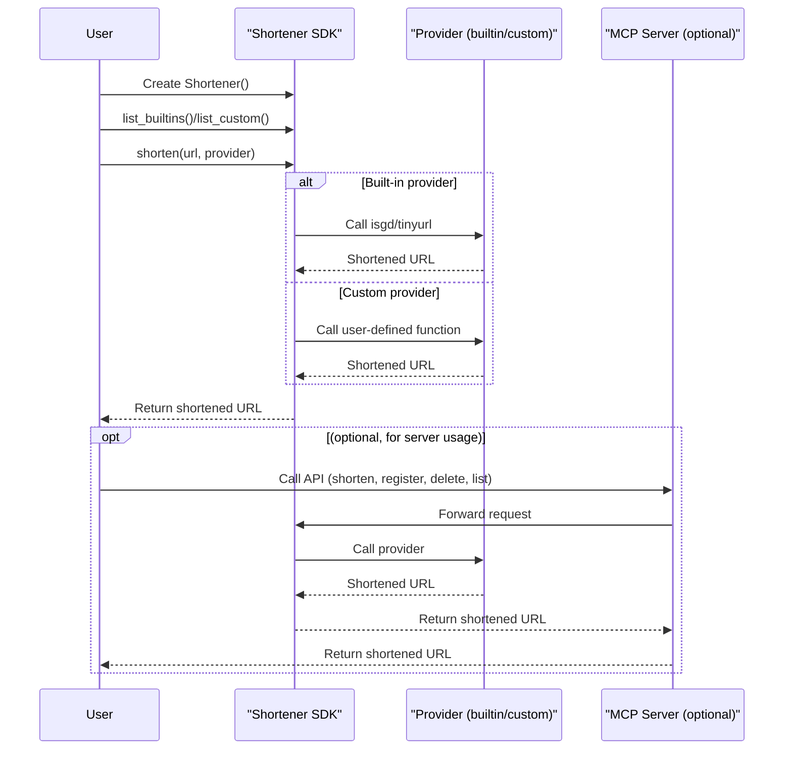

# shortl

A simple, extensible Python library for URL shortening with built-in and custom providers.


[](https://opensource.org/licenses/MIT)

---

## Table of Contents
- [How It Works](#how-it-works)
- [Key Features](#key-features)
- [Installation](#installation)
- [Usage](#usage)
- [Architecture](#architecture)
- [Contributing](#contributing)
- [License](#license)

---

## How It Works

`shortl` provides a unified, extensible interface for shortening URLs in Python. It supports both built-in providers (like is.gd and TinyURL) and user-defined custom providers, which can be registered at runtime as Python functions or code strings. The library can be used as a standalone SDK or as a server via MCP (Modular Command Platform) for remote or CLI-based URL shortening.

### Sequence Overview



---

## Key Features

- **Simple API**: Shorten URLs with a single method call.
- **Built-in Providers**: Use popular services like is.gd and TinyURL out of the box.
- **Custom Providers**: Register your own Python functions or code as shorteners at runtime.
- **Provider Management**: List, add, and remove custom providers dynamically.
- **Type-annotated**: All code uses Python built-in type annotations for clarity and safety.
- **Extensible**: Easily integrate with other systems or extend with new providers.
- **MCP Server Integration**: Run as a server for remote/CLI access to all features.

---

## Installation

### Requirements
- Python >= 3.12

### Install with [uv](https://github.com/astral-sh/uv) (recommended)

```sh
uv add shortl
uv sync
```

Or, for development:

```sh
git clone https://github.com/yourusername/shortl.git
cd shortl
uv sync
```

#### Optional dependencies
- For MCP server/CLI: `uv add mcp[cli]`
- For testing: `uv add pytest`

---

## Usage

### Basic Usage (SDK)

```python
from shortl.shortl import Shortener, custom_shortener

shortener = Shortener()

# Built-in usage
print(shortener.shorten("https://example.com", "isgd"))

# Custom provider
@custom_shortener
def myshort(url: str) -> str:
    return "short-" + url

print(shortener.shorten("https://example.com", "myshort"))
```

### Using the MCP Server

You can add this config to your MCP client to use the shortl MCP server:

```sh
uv run shortl_mcp
```

This exposes tools for:
- Creating custom shorteners
- Deleting providers
- Listing providers
- Shortening URLs

---

## Architecture

- **Shortener SDK**: Main interface for all URL shortening operations. Handles provider registration, listing, and invocation.
- **Providers**: Functions that implement the actual shortening logic. Built-in (is.gd, TinyURL) and custom (user-defined).
- **MCP Server**: Optional server exposing all features via a modular command platform for automation, remote, or CLI use.

### Provider Management
- Register custom providers as Python functions or code strings.
- Delete custom providers by name (cannot delete built-ins).
- List all available providers (with type: built-in or custom).

### Error Handling
- Raises `ValueError` if a provider is not found.
- Raises `TypeError` if a provider is not callable or returns the wrong type.
- Handles network and provider errors gracefully.

---

## Contributing

Contributions are welcome! Please open issues or pull requests for bug fixes, new features, or documentation improvements.

1. Fork the repository
2. Create a new branch
3. Make your changes (ensure all code is type-annotated)
4. Add or update tests
5. Run tests with `uv run pytest`
6. Submit a pull request

---

## License

This project is licensed under the MIT License. See [LICENSE](LICENSE) for details. 