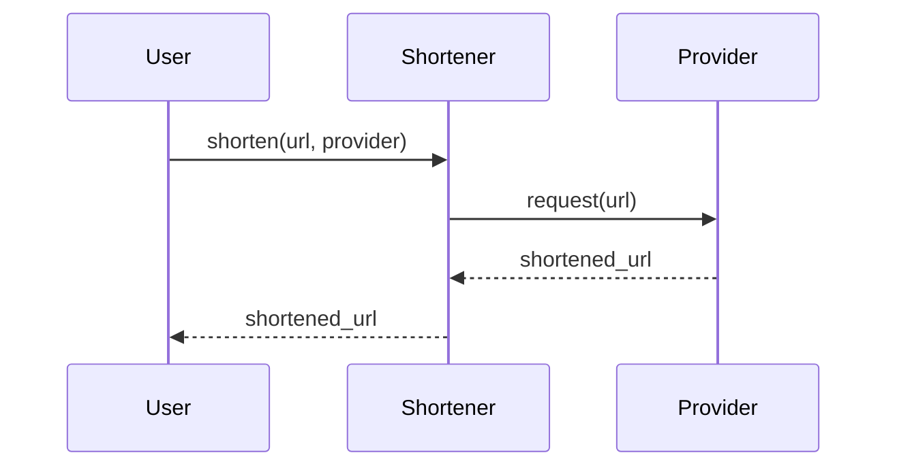

# shortl

A simple, extensible Python library for URL shortening with built-in and custom providers.


[](https://opensource.org/licenses/MIT)


## Table of Contents

- [How It Works](#how-it-works)
- [Key Features](#key-features)
- [Installation](#installation)
- [Usage](#usage)
- [Contributing](#contributing)
- [License](#license)




## How It Works

The `Shortener` class is the main interface for shortening URLs. It includes built-in providers like `isgd` and `tinyurl`, and also supports custom providers.

When you call the `shorten` method with a URL and a provider, it uses the specified provider to shorten the URL and returns the shortened URL.

## Key Features

- **Built-in Providers**: Comes with `isgd` and `tinyurl` built-in.
- **Extensible**: Easily add your own custom URL shortening providers.
- **Simple Interface**: A simple and intuitive API for shortening URLs.

## Installation

```bash
pip install git+https://github.com/mdonmez/shortl.git@master#egg=shortl
```

## Usage

### Built-in Providers

```python
from shortl import Shortener

s = Shortener()

short_url = s.shorten("https://www.example.com", s.builtin_providers.isgd)
print(short_url)
```

### Custom Providers

```python
from shortl import Shortener, custom_shortener

s = Shortener()

@custom_shortener
def provider_example(url: str) -> str:
    return "https://custom.example/" + url

short_url = s.shorten("https://www.example.com", provider_example)
print(short_url)
```

## Contributing

Contributions are welcome! Please feel free to submit a pull request or open an issue.

## License

This project is licensed under the MIT License - see the [LICENSE](LICENSE) file for details.
